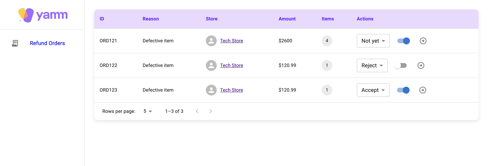
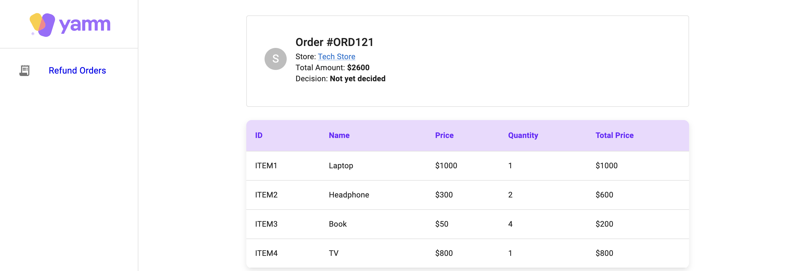

# Refund Orders Dashboard  

A simple **Refund Orders Dashboard** built with **React**, **Vite**, **Typescript** and **MUI**, featuring a reusable and dynamic table component.  

## Features  

- **Order Management**: View refund order details with item breakdowns.  
- **Reusable Table Component**: A flexible table for displaying dynamic data.  
- **Order Actions**: Update order status and decisions with real-time UI updates.  
- **Responsive UI**: Clean and modern design using MUI components.  

## Reusable Table Component  

The `DataTable` component is a reusable table designed to handle various datasets with minimal configuration.  

### Usage  

```tsx
<DataTable headers={headers} data={items} pagination={false} />
```
### Props  

| Prop        | Type                 | Description                                    |
|------------|----------------------|------------------------------------------------|
| `headers`  | `TableHeader<T>[]`    | Defines table columns and render logic        |
| `data`     | `T[]`                 | Array of objects to be displayed in the table |
| `pagination` | `boolean`           | Enables or disables pagination                |


Example **headers** configuration:
```tsx
const headers: TableHeader<Item>[] = [
    { id: 'id', label: 'ID' },
    { id: 'name', label: 'Name' },
    { id: 'price', label: 'Price', render: (row) => `$${row.price}` },
    { id: 'quantity', label: 'Quantity' },
    { id: 'total_price', label: 'Total Price', render: (row) => row.price * row.quantity },
];

```

## Runnig Instructions
- On terminal, run: `npm install`
- Run the server: 
```
npx json-server --watch db.json --port 5000
```
- Add a new terminal and run: 
```
npm run dev
```

- Open a web browser and hit `http://localhost:5173`


## Screenshots


#

